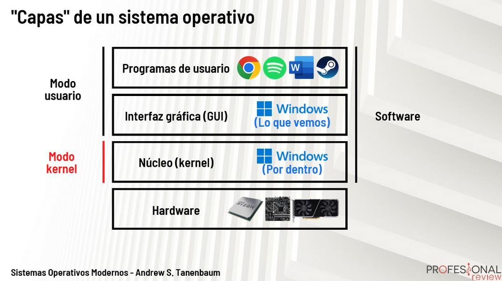

Universidad de San Carlos de Guatemala

Facultad de Ingeniería

Escuela de Ciencias y Sistemas

Sistemas Operativos 1

Segundo Semestre 2023

# 
**KERNEL**

## **¿Que es el Kernel?**
En pocas palabras, es el intermediario entre el usuario y la maquina, encargado de la mayor parte de funciones relevantes del Sistema Operativo, teniendo a su cargo todos los aspectos de organizacion de los procesos y datos, ademas de manejar los accesos al procesador y la memoria y el hardware coenctado a ella.

## **TIPOS DE KERNEL**
### **Kernel monolítico:**
+ Es el tipo de kernel más antiguo y tradicional.
+ Todo el código del kernel se ejecuta en el espacio privilegiado (modo kernel) y comparte el mismo espacio de memoria.
+ Tiene un rendimiento eficiente, ya que las llamadas al sistema y las operaciones de hardware son directas.
+ Un fallo en una parte del kernel puede afectar a todo el sistema.
+ Ejemplos de sistemas operativos con kernel monolítico son Linux (dependiendo de la configuración), FreeBSD y OpenBSD.

### **Kernel en espacio de usuario (Microkernel):**
+ El kernel se divide en módulos pequeños y esenciales, que se ejecutan en espacio de usuario, fuera del espacio privilegiado.
+ Solo una pequeña parte del kernel permanece en el espacio privilegiado.
+ Proporciona una mayor seguridad y estabilidad, ya que los fallos en los módulos pueden ser recuperados sin afectar el sistema en su conjunto.
+ El rendimiento puede ser ligeramente inferior debido a la necesidad de pasar mensajes entre los módulos para las operaciones del sistema.
+ Ejemplos de sistemas operativos con microkernel son MINIX y QNX.

### **Kernel híbrido:**
+ Es una combinación de características del kernel monolítico y el microkernel.
+ Algunos servicios se ejecutan en espacio de usuario (modo usuario), mientras que otros servicios más críticos se ejecutan en espacio privilegiado (modo kernel).
+ Ofrece un equilibrio entre rendimiento y estabilidad.
+ Ejemplos de sistemas operativos con kernel híbrido son Windows NT (y versiones posteriores) y macOS.

### **Kernel exokernel:**
+ Es un enfoque más experimental en el diseño del kernel.
+ Expone directamente el hardware al espacio de usuario, permitiendo que los programas tengan un mayor control sobre los recursos del sistema.
+ Permite la implementación de políticas de administración de recursos por parte de bibliotecas o aplicaciones en lugar del kernel.
+ Requiere un mayor conocimiento técnico por parte de los desarrolladores y puede ser menos seguro.
+ Ejemplos de sistemas que han experimentado con exokernels son XOK y Nemesis.

## **USER VS KERNEL MODE**

### **Modo de Usuario:**

+ Es el modo en el que se ejecutan la mayoría de las aplicaciones y procesos del usuario en el sistema operativo.
+ En este modo, los procesos tienen acceso limitado a los recursos del sistema y solo pueden realizar operaciones que no afecten directamente al hardware o a otras aplicaciones.
+ Las instrucciones que se ejecutan en el modo de usuario están restringidas y supervisadas por el kernel del sistema operativo.
+ Si un proceso intenta realizar una operación que requiere privilegios más altos o acceder a recursos protegidos, se genera una excepción que pasa al modo kernel para su gestión.

### **Modo Kernel:**

+ Es el modo en el que se ejecuta el núcleo del sistema operativo, es decir, el kernel.
+ En este modo, el kernel tiene acceso completo a todos los recursos del sistema y puede realizar operaciones críticas, como acceder a hardware, gestionar memoria, modificar tablas de página, entre otras tareas esenciales para el funcionamiento del sistema.
+ Las instrucciones que se ejecutan en el modo kernel no están restringidas y pueden acceder a cualquier parte del sistema.
+ Solo el kernel y los controladores de dispositivos pueden operar en este modo.

>[!MORELIKETHIS]
>
>* ¿QUE ES EL [KERNEL?] (https://www.thepowermba.com/es/blog/que-es-el-kernel-cual-es-su-trabajo-y-como-funciona)